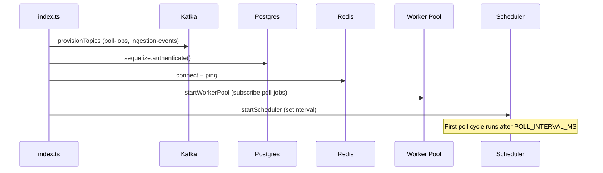
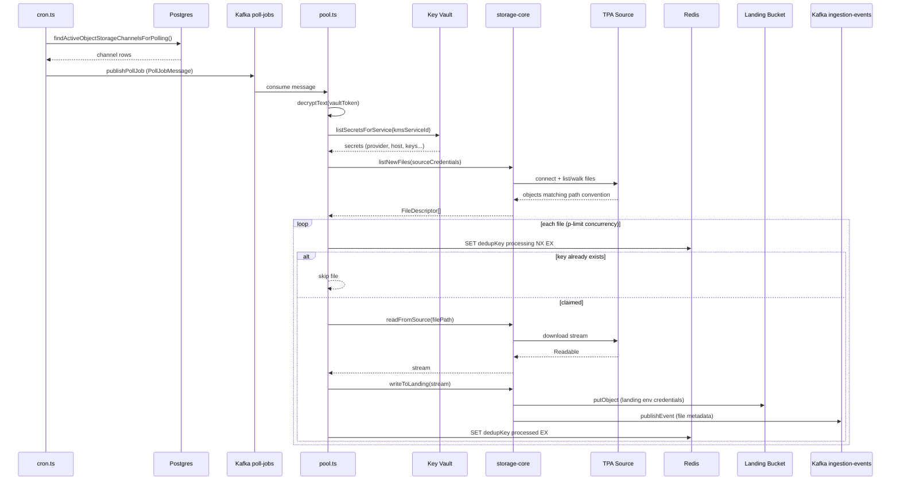
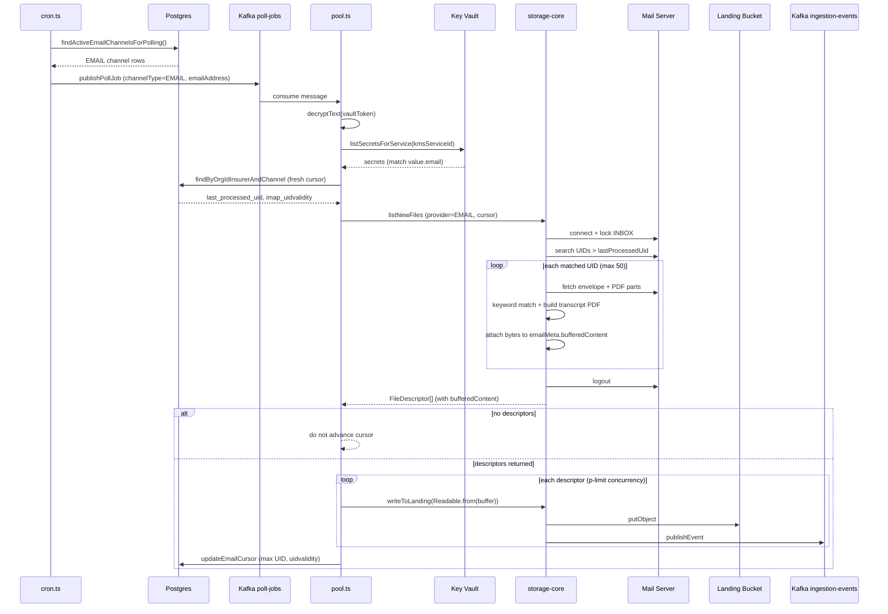
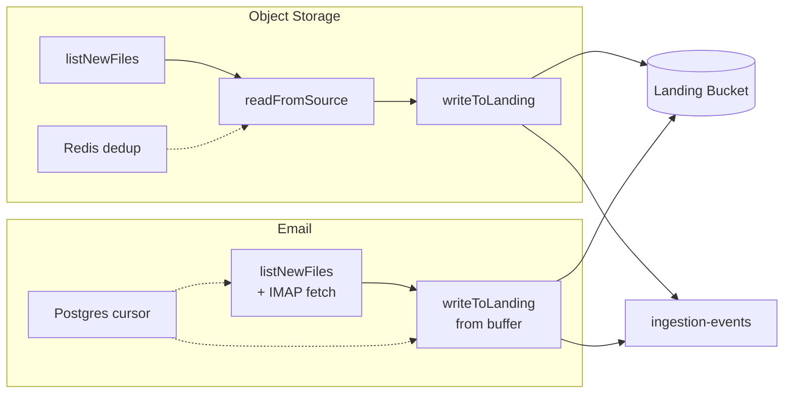

# Poll Orchestrator

Kafka-backed multi-tenant poll scheduler and worker pool for Sentinel Protocol ingestion.

This service **does not expose an HTTP API**. It runs as a background process that:

1. Reads onboarded channels from Postgres (`Ingestion_Channel_Master`)
2. Publishes poll jobs to Kafka (`poll-jobs`)
3. Consumes jobs in a worker pool
4. Fetches source credentials from Key Vault at runtime
5. Delegates all file I/O to `@sentinel/storage-core` (list → read → write)
6. Deduplicates FTP/object-storage files via Redis
7. Advances IMAP cursors for email channels in Postgres

It centralizes polling for **FTP, MinIO, S3, GCP, Azure, and Email** channels. WhatsApp ingestion is **not** handled here — it is webhook-driven in `whatsapp-to-ftp-server`.

---

## Table of Contents

- [Architecture](#architecture)
- [Dependencies](#dependencies)
- [Quick Start](#quick-start)
- [Environment Variables](#environment-variables)
- [Startup Sequence](#startup-sequence)
- [Data Model](#data-model)
- [Scheduler Flow](#scheduler-flow)
- [Worker Flow](#worker-flow)
- [Sequence Diagrams](#sequence-diagrams)
- [Object-Storage Pipeline](#object-storage-pipeline-ftp--minio--s3--gcp--azure)
- [Email Pipeline](#email-pipeline-imap)
- [storage-core Integration](#storage-core-integration)
- [Kafka Topics](#kafka-topics)
- [Relationship to Other Services](#relationship-to-other-services)
- [Onboarding Prerequisites](#onboarding-prerequisites)
- [Troubleshooting](#troubleshooting)
- [Known Gaps](#known-gaps)

---

## Architecture

```
┌─────────────────────────────────────────────────────────────────────────┐
│                         poll-orchestrator                                │
│                                                                          │
│  ┌──────────────┐    ┌──────────────┐    ┌──────────────────────────┐  │
│  │  Scheduler   │───▶│ Kafka        │───▶│  Worker Pool             │  │
│  │  (cron.ts)   │    │ poll-jobs    │    │  (workers/pool.ts)       │  │
│  └──────┬───────┘    └──────────────┘    └───────────┬──────────────┘  │
│         │ reads                                       │                  │
│         ▼                                             ▼                  │
│  ┌──────────────┐                          ┌──────────────────┐         │
│  │  Postgres    │                          │  Key Vault       │         │
│  │  Ingestion_  │◀── email cursor writes ──│  (source creds)  │         │
│  │  Channel_    │                          └────────┬─────────┘         │
│  │  Master      │                                   │                  │
│  └──────────────┘                                   ▼                  │
│                                          ┌──────────────────┐         │
│  ┌──────────────┐                        │  storage-core    │         │
│  │  Redis       │◀── FTP dedup ──────────│  list/read/write │         │
│  └──────────────┘                        └────────┬─────────┘         │
│                                                    │                    │
└────────────────────────────────────────────────────┼────────────────────┘
                                                     │
                              ┌──────────────────────┼──────────────────────┐
                              ▼                      ▼                      ▼
                       TPA source            Landing bucket          Kafka
                       (FTP/IMAP/S3)         (MinIO/S3 env)     ingestion-events
```

**Mental model:** Poll-orchestrator is a cron + Kafka worker that turns DB channel rows into file transfers. It never opens FTP/IMAP/S3 directly — it always calls `storage-core`. Source credentials come from Key Vault at job time. Landing bucket config comes from orchestrator env vars.

---

## Dependencies

| System | Role |
|--------|------|
| **PostgreSQL** | Channel registry (`Ingestion_Channel_Master`) — shared with ingestion microservices |
| **Kafka** | Job queue (`poll-jobs`) + downstream events (`ingestion-events`) |
| **Redis** | FTP/object-storage dedup locks |
| **Key Vault** | Source credentials (FTP host, IMAP password, MinIO keys, etc.) |
| **storage-core** | Source readers + landing writers + Kafka event publish |
| **Landing storage** | Sentinel destination bucket (MinIO/S3/GCP/Azure via env) |

---

## Quick Start

```bash
cd poc-v0.1/poll-orchestrator
cp .env.example .env
# Edit .env — DB_URL, KAFKA_BROKER, REDIS_URL, APP_ENCRYPTION_KEY, STORAGE_PROVIDER, etc.

npm install
npm run dev
```

**Scripts:**

| Command | Description |
|---------|-------------|
| `npm run dev` | Start with `tsx watch` |
| `npm run build` | Compile TypeScript |
| `npm start` | Run compiled `dist/index.js` |
| `npm run typecheck` | Type-check without emit |

**Prerequisites:** Postgres, Kafka, Redis, Key Vault, and landing storage (MinIO/S3) must be running. Channels must be provisioned via `ftp-to-ftp-server` or `email-to-ftp-server` before polling begins.

---

## Environment Variables

| Variable | Default | Purpose |
|----------|---------|---------|
| `DB_URL` | *(required)* | Shared Postgres connection string |
| `KAFKA_BROKER` | `localhost:9092` | Kafka broker(s), comma-separated |
| `POLL_JOBS_TOPIC` | `poll-jobs` | Job topic name |
| `POLL_INTERVAL_MS` | `300000` (5 min) | Scheduler interval |
| `POLL_CONCURRENCY` | `10` | Max parallel jobs/files |
| `REDIS_URL` | `redis://localhost:6380` | Dedup store |
| `DEDUP_TTL_SEC` | `604800` (7 days) | Dedup key TTL |
| `KMS_BASE_URL` | `http://localhost:8000` | Key Vault base URL |
| `VAULT_URL` | `http://localhost:8000/api/v1` | Key Vault API path |
| `APP_ENCRYPTION_KEY` | *(required)* | Decrypts `vault_token_encrypted` from DB |
| `STORAGE_PROVIDER` | — | Landing writer: `MINIO`, `S3`, `GCP`, `AZURE` |
| `MINIO_ENDPOINT` | — | Landing MinIO endpoint |
| `MINIO_ACCESS_KEY` | — | Landing MinIO access key |
| `MINIO_SECRET_KEY` | — | Landing MinIO secret key |
| `MINIO_BUCKET` | — | Landing bucket name |
| `AWS_*` | — | Landing S3 credentials (when `STORAGE_PROVIDER=S3`) |
| `IMAP_POLL_MAILBOX` | `INBOX` | Email mailbox path (used by storage-core) |

See `.env.example` for the full list.

---

## Startup Sequence

Entry point: `src/index.ts`

1. **Provision Kafka topics** — creates `poll-jobs` and `ingestion-events` if missing
2. **Connect Postgres** — Sequelize authenticates against shared MDM DB
3. **Connect Redis** — ping for dedup availability
4. **Start worker pool** — Kafka consumer subscribes to `poll-jobs` **before** scheduler
5. **Start scheduler** — `setInterval` every `POLL_INTERVAL_MS`

Graceful shutdown (SIGINT/SIGTERM): stop scheduler → stop consumer → disconnect Redis → close DB.

> **Note:** The scheduler does **not** run a poll cycle immediately on startup — the first cycle runs after `POLL_INTERVAL_MS` elapses.

---

## Data Model

All channels live in **`Ingestion_Channel_Master`** (composite PK: `organisation_id` + `insurance_company_code` + `channel_type`).

A channel is eligible for polling when:

- `is_onboarded = true`
- `kms_service_id` is non-empty
- `vault_token_encrypted` is non-empty (encrypted org API key for Key Vault)

| Repository method | Channels selected |
|-------------------|-------------------|
| `findActiveObjectStorageChannelsForPolling()` | All where `channel_type != 'EMAIL'` |
| `findActiveEmailChannelsForPolling()` | All where `channel_type = 'EMAIL'` |

Email-specific columns:

| Column | Purpose |
|--------|---------|
| `email_address` | IMAP mailbox identity |
| `last_processed_uid` | IMAP high-water mark |
| `imap_uidvalidity` | RFC 3501 UID generation (detects mailbox reset) |

Channels are **provisioned by ingestion microservices**, not by poll-orchestrator:

- **FTP/MinIO/S3/etc.** → `ftp-to-ftp-server` integration (`linkBucket`)
- **Email** → `email-to-ftp-server` provisioning (`registerEmailSource`)

---

## Scheduler Flow

File: `src/scheduler/cron.ts`

Every `POLL_INTERVAL_MS`:

### Object-storage channels (FTP, MINIO, S3, …)

For each active non-EMAIL row:

1. Build a `PollJobMessage` with org/insurer/KMS/vault token/channel type
2. Publish to Kafka `poll-jobs` with message key `{orgId}:{kmsServiceId}`

### Email channels

For each active EMAIL row:

1. Skip if `vault_token_encrypted` is missing (logs backfill warning)
2. Build `PollJobMessage` with `credId: email:{email_address}`, `channelType: 'EMAIL'`
3. Publish to `poll-jobs`

The scheduler **never** connects to FTP, IMAP, or buckets — it only reads DB metadata and enqueues Kafka messages.

---

## Worker Flow

File: `src/workers/pool.ts`

Consumer group: `poll-orchestrator-workers`  
Concurrency: `p-limit(POLL_CONCURRENCY)` at message and per-file level

For every Kafka message:

1. Parse JSON → `PollJobMessage`
2. Decrypt `job.vaultToken` → plain Key Vault API token
3. Fetch secrets → `vaultClient.listSecretsForService(kmsServiceId, plainToken)`
4. Branch on `job.channelType === 'EMAIL'` → object-storage handler or email handler

---

## Sequence Diagrams

### Startup



### Object-storage poll (FTP / MinIO / S3)

One scheduler cycle for a single channel, then one file transfer:



**MinIO/S3 variant:** Same diagram — `SRC` is the TPA bucket (MinIO SDK or AWS SDK) instead of an FTP server. Vault secret `provider` selects the storage-core reader (`MINIO`, `S3`, etc.).

### Email poll (IMAP)

Email skips Redis dedup and `readFromSource`; content is buffered during `listNewFiles`:



### Side-by-side: object-storage vs email



---

## Object-Storage Pipeline (FTP / MinIO / S3 / GCP / Azure)

> See [Object-storage poll sequence diagram](#object-storage-poll-ftp--minio--s3) for the full end-to-end flow.

### 1. Pick credentials from Vault

Find the first Vault secret whose value object has a `provider` field. That `provider` string (e.g. `FTP`, `MINIO`, `S3`) determines which storage-core reader runs — **not** `job.channelType` from the Kafka message.

Typical Vault credential shapes (stored by `ftp-to-ftp-server` integration):

| Provider | Vault value fields |
|----------|-------------------|
| FTP | `host`, `port`, `user`, `password`, `secure`, `bucket` |
| MINIO | `endpoint`, `access_key`, `secret_key`, `bucket` |
| S3 | `region`, `access_key`, `secret_key`, `bucket`, optional `endpoint` |
| GCP | `project_id`, `access_key`, `secret_key`, `bucket` |
| AZURE | `account_name`, `account_key`, `container` |

### 2. List files — `storage-core.listNewFiles()`

| Driver | Connection | Listing behavior |
|--------|------------|------------------|
| **FTP** | `basic-ftp` → host:port | Recursively walks `/`, parses `/Health_Claims/.../{claimFolder}/{file}` |
| **MinIO** | MinIO SDK → TPA endpoint | Lists all objects in source bucket, parses 6+ segment keys |
| **S3** | AWS SDK → region + keys | Lists all objects, parses 7+ segment keys |

Returns `FileDescriptor[]`. **All matching files** are returned every cycle — dedup happens in the orchestrator, not in storage-core.

### 3. Redis dedup (per file)

```
Key:   file:dedup:{ftp|whatsapp}:{orgId}:{insuranceCompanyCode}:{filePath}
Flow:  SET processing NX EX → transfer → SET processed EX
       On failure: DEL key (allows retry next cycle)
```

Email channels skip Redis dedup — IMAP UID cursor handles idempotency.

### 4. Read from source — `storage-core.readFromSource()`

- **FTP:** new connection, streams file via `downloadTo`
- **MinIO/S3:** `getObject(bucket, filePath)` → readable stream

### 5. Write to landing — `storage-core.writeToLanding()`

Landing bucket credentials come from **orchestrator env vars**, not Vault.

Object key pattern:

```
{orgId}/{insuranceCompanyCode}/{YYYY-MM-DD}/{channel}/{claimFolder}/{fileName}
```

where `channel` = source channel lowercased with `_ingestion` stripped (`ftp`, `email`, `whatsapp`).

After upload, storage-core publishes an **`ingestion-events`** Kafka message with file metadata.

### Two-bucket model

| Bucket | Credentials source | Used for |
|--------|-------------------|----------|
| **Source** (TPA-side) | Key Vault secret | Read via storage-core readers |
| **Landing** (Sentinel-side) | Orchestrator env (`STORAGE_PROVIDER`, `MINIO_*`, `AWS_*`) | Write via storage-core writers |

---

## Email Pipeline (IMAP)

> See [Email poll sequence diagram](#email-poll-imap) for the full end-to-end flow.

Email intentionally diverges: content is fetched during listing, not in a separate read step.

### 1. Pick IMAP credentials from Vault

Email secrets have **no** `provider` field. Stored under keys like `imap:{email}`:

```json
{ "email": "...", "password": "...", "imap_host": "...", "imap_port": 993 }
```

Worker matches secret where `value.email === job.emailAddress`.

### 2. Load fresh IMAP cursor from DB

Always reads `last_processed_uid` and `imap_uidvalidity` from Postgres — never trusts cursor from the Kafka message.

### 3. List + download — `storage-core.listNewFiles()` (email reader)

Inside `storage-core/src/drivers/reader/email.reader.ts`:

1. Connect to IMAP via `imapflow`
2. Lock mailbox (`INBOX` by default, override with `IMAP_POLL_MAILBOX`)
3. Compare `UIDVALIDITY` — reset cursor to 0 if mailbox was recreated
4. Search UIDs `> lastProcessedUid`, cap at 50 messages
5. For each UID: match claim keywords, require PDF attachments, download PDFs + build transcript PDF
6. Attach bytes to `FileDescriptor.emailMeta.bufferedContent`

**`readFromSource` is not used for email** — it throws by design.

### 4. Write each descriptor to landing

```typescript
writeToLanding(Readable.from(descriptor.emailMeta.bufferedContent), { ... })
```

Each matched email produces:

- `email-transcript.pdf` (generated)
- One landing object per unique PDF attachment (SHA-256 dedup within same UID)

### 5. Advance IMAP cursor in DB

After attempting all writes:

- Set `last_processed_uid` to max UID in the batch
- Update `imap_uidvalidity` if generation changed
- If zero descriptors returned, **do not** advance cursor
- Cursor advances even if some individual uploads failed (advance-on-scan semantics)

---

## storage-core Integration

Poll-orchestrator calls exactly three public APIs from `@sentinel/storage-core`:

| Function | Used by | Purpose |
|----------|---------|---------|
| `listNewFiles(ReadInput)` | Both pipelines | Connect to source, return file descriptors |
| `readFromSource(ReadInput & { filePath })` | Object-storage only | Stream one file from source |
| `writeToLanding(stream, WriteInput)` | Both pipelines | Upload to landing + publish `ingestion-events` |

Orchestrator never imports reader/writer drivers directly.

Environment variables consumed by storage-core must be set on the poll-orchestrator process:

```
STORAGE_PROVIDER, MINIO_*, AWS_*, KAFKA_BROKER, IMAP_POLL_MAILBOX (optional)
```

---

## Kafka Topics

| Topic | Producer | Consumer | Payload |
|-------|----------|----------|---------|
| `poll-jobs` | Scheduler | Worker pool | `PollJobMessage` — who to poll |
| `ingestion-events` | storage-core (inside `writeToLanding`) | Downstream processors | File landed metadata |

`PollJobMessage` shape:

```typescript
{
  credId: string              // Kafka partition key
  orgId: string
  region: string
  kmsServiceId: string
  vaultToken: string          // AES-256-GCM encrypted (decrypted at worker)
  channelType: 'FTP' | 'S3' | 'MINIO' | 'EMAIL' | ...
  scheduledAt: string         // ISO timestamp
  insuranceCompanyCode?: string
  emailAddress?: string       // EMAIL channels only
}
```

---

## Relationship to Other Services

| Service | Relationship |
|---------|--------------|
| **ftp-to-ftp-server** | Provisions object-storage channels + Vault secrets; has legacy inline `poll.engine.ts` (same storage-core calls, no Kafka) |
| **email-to-ftp-server** | Provisions email channels, sets IMAP cursor at registration |
| **whatsapp-to-ftp-server** | Webhook + Kafka harvester — **not** poll-orchestrator |
| **key-vault** | Stores all source credentials; orchestrator reads via `x-vault-token` |
| **storage-core** | Shared library for all read/write/Kafka publish |

---

## Onboarding Prerequisites

For a channel to be polled, all of the following must be true:

1. Row in `Ingestion_Channel_Master` with `is_onboarded = true`
2. `kms_service_id` set to Key Vault service ID
3. `vault_token_encrypted` set (org vault API key, encrypted with `APP_ENCRYPTION_KEY`)
4. **Object storage:** Vault secret with `{ provider: 'FTP'|'MINIO'|... }` + connection fields
5. **Email:** Vault secret with `{ email, password, imap_host, imap_port }`; run backfill script if migrating from legacy `Email_Source_Master`
6. poll-orchestrator running with correct `STORAGE_PROVIDER` + landing bucket env
7. Kafka, Redis, Postgres, Key Vault all reachable

---

## Troubleshooting

| Symptom | Where to look |
|---------|---------------|
| No jobs published | `Ingestion_Channel_Master` — check `is_onboarded`, `kms_service_id`, `vault_token_encrypted`; scheduler logs |
| Job published but no files | Key Vault secrets; `listNewFiles` driver logs; source path/key conventions |
| Files listed but skipped | Redis dedup keys (`file:dedup:*`) — may already be `processing` or `processed` |
| Upload fails | `STORAGE_PROVIDER` and landing env vars on orchestrator process |
| Email re-processes same mail | `last_processed_uid` / `imap_uidvalidity` in DB |
| Downstream doesn't see files | `ingestion-events` topic — published by storage-core, not orchestrator |
| First poll delayed after restart | Expected — scheduler waits `POLL_INTERVAL_MS` before first cycle |

---

## Known Gaps

1. **No immediate poll on startup** — first cycle waits `POLL_INTERVAL_MS`.
2. **WHATSAPP channel type** appears in types/dedup but there is no WHATSAPP reader in storage-core; WhatsApp uses webhooks instead.
3. **SFTP** can be stored in Vault but storage-core has no SFTP driver — polls fail at driver resolution.
4. **`listNewFiles` lists everything** — for large buckets/FTP trees, every cycle re-lists all files; Redis dedup prevents re-upload but not re-listing cost.
5. **Legacy models** (`channel.model.ts`, `email-source.model.ts`) are initialized in `db.ts` but the scheduler uses unified `IngestionChannelModel` only.
6. **ingestion-events consumer** is not part of poll-orchestrator — a separate downstream service must consume landed-file events.
7. **Source vs landing credentials are separate** — a common onboarding mistake is pointing landing env at the TPA bucket.

---

## Project Structure

```
src/
├── index.ts                          # Entry point — startup + graceful shutdown
├── config.ts                         # Environment variable loading
├── db.ts                             # Sequelize + model initialization
├── kafka.ts                          # Topic provisioning, producer, consumer
├── redis.ts                          # Redis client for dedup
├── scheduler/
│   └── cron.ts                       # Periodic job publisher
├── workers/
│   └── pool.ts                       # Kafka consumer + poll handlers
├── repositories/
│   └── ingestionChannel.repository.ts
├── models/
│   ├── ingestionChannel.model.ts     # Primary channel model (used by scheduler)
│   ├── channel.model.ts              # Legacy (initialized, not used by scheduler)
│   └── email-source.model.ts         # Legacy (initialized, not used by scheduler)
└── utils/
    ├── crypto.ts                     # AES-256-GCM encrypt/decrypt
    ├── dedupKey.ts                   # Redis dedup key builder
    └── vault-client.ts               # Key Vault HTTP client
```
