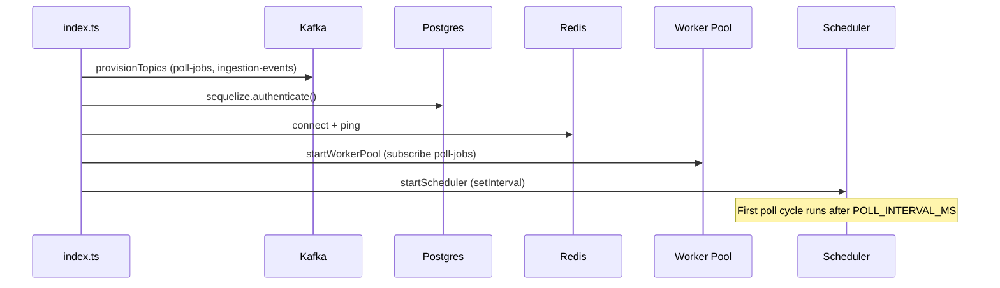
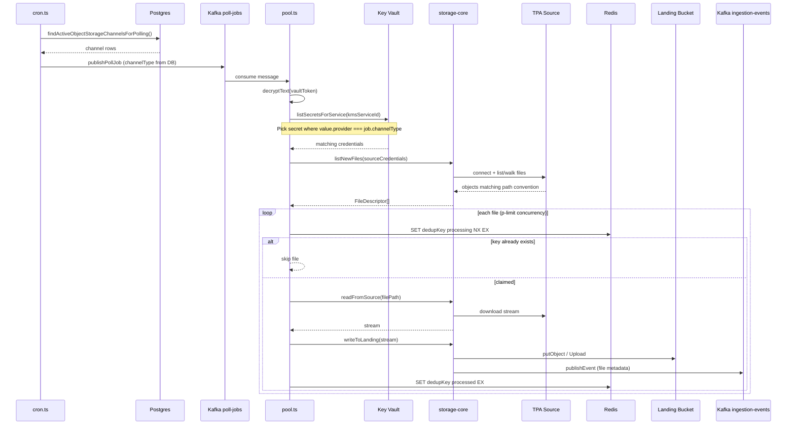
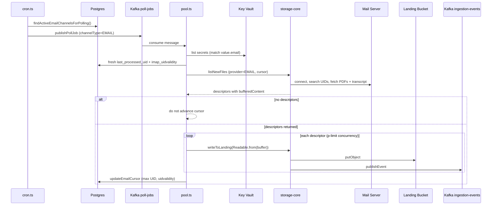
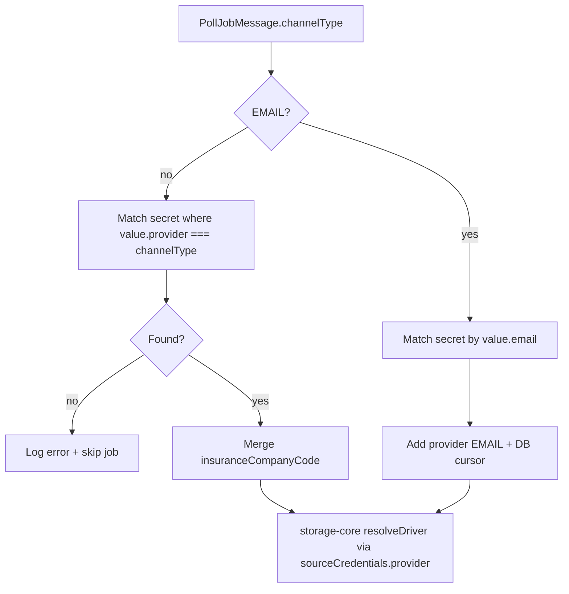
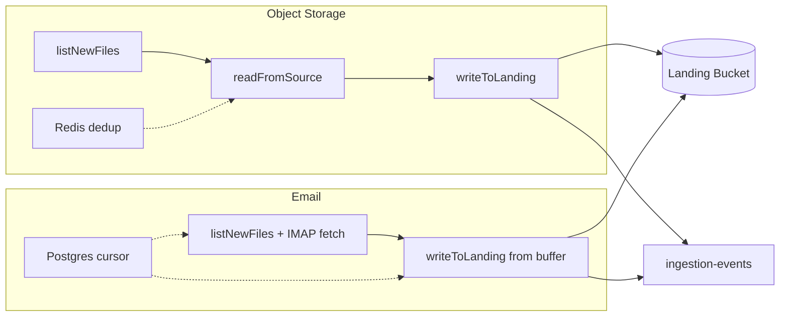

# Poll Orchestrator

Kafka-backed multi-tenant poll scheduler and worker pool for Sentinel Protocol ingestion.

This service **does not expose an HTTP API**. It runs as a background process that:

1. Reads onboarded channels from Postgres (`Ingestion_Channel_Master`)
2. Publishes poll jobs to Kafka (`poll-jobs`)
3. Consumes jobs in a worker pool
4. Fetches source credentials from Key Vault at runtime
5. Delegates all file I/O to `@sentinel/storage-core` (list → read → write)
6. Deduplicates object-storage files via Redis
7. Advances IMAP cursors for email channels in Postgres

It centralizes polling for **FTP, SFTP, MinIO, S3, Azure, and Email** channels. WhatsApp ingestion is **not** handled here — it is webhook-driven in `whatsapp-to-ftp-server`.

**Mental model:** Poll-orchestrator is a cron + Kafka worker that turns DB channel rows into file transfers. It never opens FTP/IMAP/S3 directly — it always calls `storage-core`. Source credentials come from Key Vault at job time. Landing bucket config comes from orchestrator env vars.

---

## Table of Contents

- [What Changed (v2)](#what-changed-v2)
- [Architecture](#architecture)
- [Dependencies](#dependencies)
- [Quick Start](#quick-start)
- [Environment Variables](#environment-variables)
- [Startup Sequence](#startup-sequence)
- [Data Model](#data-model)
- [Scheduler Flow](#scheduler-flow)
- [Worker Flow](#worker-flow)
- [Sequence Diagrams](#sequence-diagrams)
- [Object-Storage Pipeline](#object-storage-pipeline-ftp--sftp--minio--s3--azure)
- [Email Pipeline](#email-pipeline-imap)
- [storage-core Integration](#storage-core-integration)
- [Source Path Conventions](#source-path-conventions)
- [Provider Support Matrix](#provider-support-matrix)
- [Kafka Topics](#kafka-topics)
- [Relationship to Other Services](#relationship-to-other-services)
- [Onboarding Prerequisites](#onboarding-prerequisites)
- [Troubleshooting](#troubleshooting)
- [Known Gaps](#known-gaps)
- [Project Structure](#project-structure)

---

## What Changed (v2)

| Area | Before | Now |
|------|--------|-----|
| **Vault secret selection** | First secret with any `provider` field | **Strict match:** `secret.value.provider === job.channelType` |
| **SFTP support** | Not in storage-core | **Full SFTP reader** (`ssh2-sftp-client`) |
| **Azure reader** | Stub | **Fully implemented** (`@azure/storage-blob`) |
| **GCP reader/writer** | Stub | Still **stub** (throws) |
| **Azure writer** | Stub | Still **stub** (throws) |
| **FTP path parsing** | 6 segments, root always `/` | **7 segments**, root = `credentials.bucket` or `/` |
| **Dedup source mapping** | Binary FTP vs whatsapp | `sourceTypeForChannelType()` maps all channel types |
| **`sourceChannel` mapping** | WHATSAPP fell through to FTP | Explicit: EMAIL → `EMAIL_INGESTION`, WHATSAPP → `WHATSAPP_INGESTION`, else → `FTP_INGESTION` |
| **Integration provisioning** | Less strict channel typing | DB `channel_type` = Vault `provider` (FTP, SFTP, MINIO, S3, etc.) |
| **S3 writer** | Basic put | `@aws-sdk/lib-storage` Upload for streaming multipart |

---

## Architecture

```
┌─────────────────────────────────────────────────────────────────────────┐
│                         poll-orchestrator                                │
│                                                                          │
│  ┌──────────────┐    ┌──────────────┐    ┌──────────────────────────┐  │
│  │  Scheduler   │───▶│ Kafka        │───▶│  Worker Pool             │  │
│  │  (cron.ts)   │    │ poll-jobs    │    │  (workers/pool.ts)       │  │
│  └──────┬───────┘    └──────────────┘    └───────────┬──────────────┘  │
│         │ reads                                       │                  │
│         ▼                                             ▼                  │
│  ┌──────────────┐                          ┌──────────────────┐         │
│  │  Postgres    │                          │  Key Vault       │         │
│  │  Ingestion_  │◀── email cursor writes ──│  (source creds)  │         │
│  │  Channel_    │                          └────────┬─────────┘         │
│  │  Master      │                                   │                  │
│  └──────────────┘                                   ▼                  │
│                                          ┌──────────────────┐         │
│  ┌──────────────┐                        │  storage-core    │         │
│  │  Redis       │◀── object dedup ─────│  list/read/write │         │
│  └──────────────┘                        └────────┬─────────┘         │
│                                                    │                    │
└────────────────────────────────────────────────────┼────────────────────┘
                                                     │
                              ┌──────────────────────┼──────────────────────┐
                              ▼                      ▼                      ▼
                       TPA source            Landing bucket          Kafka
                  (FTP/SFTP/IMAP/S3)      (MinIO/S3 env)     ingestion-events
```

### Two-bucket model

| Bucket | Credentials from | Used for |
|--------|------------------|----------|
| **Source** (TPA-side) | Key Vault secret | `listNewFiles` + `readFromSource` |
| **Landing** (Sentinel-side) | Orchestrator env (`STORAGE_PROVIDER`, `MINIO_*`, `AWS_*`) | `writeToLanding` |

---

## Dependencies

| System | Role |
|--------|------|
| **PostgreSQL** | Channel registry (`Ingestion_Channel_Master`) — shared with ingestion microservices |
| **Kafka** | Job queue (`poll-jobs`) + downstream events (`ingestion-events`) |
| **Redis** | Object-storage dedup locks |
| **Key Vault** | Source credentials (FTP host, IMAP password, MinIO keys, etc.) |
| **storage-core** | Source readers + landing writers + Kafka event publish |
| **Landing storage** | Sentinel destination bucket (MinIO/S3/GCP/Azure via env) |

---

## Quick Start

```bash
cd poc-v0.1/poll-orchestrator
cp .env.example .env
# Edit .env — DB_URL, KAFKA_BROKER, REDIS_URL, APP_ENCRYPTION_KEY, STORAGE_PROVIDER, etc.

npm install
npm run dev
```

**Scripts:**

| Command | Description |
|---------|-------------|
| `npm run dev` | Start with `tsx watch` |
| `npm run build` | Compile TypeScript |
| `npm start` | Run compiled `dist/index.js` |
| `npm run typecheck` | Type-check without emit |

**Prerequisites:** Postgres, Kafka, Redis, Key Vault, and landing storage (MinIO/S3) must be running. Channels must be provisioned via `ftp-to-ftp-server` or `email-to-ftp-server` before polling begins.

---

## Environment Variables

### poll-orchestrator

| Variable | Default | Purpose |
|----------|---------|---------|
| `DB_URL` | *(required)* | Shared Postgres connection string |
| `KAFKA_BROKER` | `localhost:9092` | Kafka broker(s), comma-separated |
| `POLL_JOBS_TOPIC` | `poll-jobs` | Job topic name |
| `POLL_INTERVAL_MS` | `300000` (5 min) | Scheduler interval |
| `POLL_CONCURRENCY` | `10` | Max parallel jobs/files |
| `REDIS_URL` | `redis://localhost:6380` | Dedup store |
| `DEDUP_TTL_SEC` | `604800` (7 days) | Dedup key TTL |
| `KMS_BASE_URL` | `http://localhost:8000` | Key Vault base URL |
| `VAULT_URL` | `http://localhost:8000/api/v1` | Key Vault API path |
| `APP_ENCRYPTION_KEY` | *(required)* | Decrypts `vault_token_encrypted` from DB |
| `STORAGE_PROVIDER` | — | Landing writer: `MINIO`, `S3`, `GCP`, `AZURE` |
| `MINIO_ENDPOINT` | — | Landing MinIO endpoint |
| `MINIO_ACCESS_KEY` | — | Landing MinIO access key |
| `MINIO_SECRET_KEY` | — | Landing MinIO secret key |
| `MINIO_BUCKET` | — | Landing bucket name |
| `AWS_*` | — | Landing S3 credentials (when `STORAGE_PROVIDER=S3`) |
| `IMAP_POLL_MAILBOX` | `INBOX` | Email mailbox path (used by storage-core) |

See `.env.example` for the full list.

---

## Startup Sequence

Entry point: `src/index.ts`

1. **Provision Kafka topics** — creates `poll-jobs` and `ingestion-events` if missing
2. **Connect Postgres** — Sequelize authenticates against shared MDM DB
3. **Connect Redis** — ping for dedup availability
4. **Start worker pool** — Kafka consumer subscribes to `poll-jobs` **before** scheduler
5. **Start scheduler** — `setInterval` every `POLL_INTERVAL_MS`

Graceful shutdown (SIGINT/SIGTERM): stop scheduler → stop consumer → disconnect Redis → close DB.

> **Note:** The scheduler does **not** run a poll cycle immediately on startup — the first cycle runs after `POLL_INTERVAL_MS` elapses.

---

## Data Model

All channels live in **`Ingestion_Channel_Master`** (composite PK: `organisation_id` + `insurance_company_code` + `channel_type`).

A channel is eligible for polling when:

- `is_onboarded = true`
- `kms_service_id` is non-empty
- `vault_token_encrypted` is non-empty (encrypted org API key for Key Vault)

| Repository method | Channels selected |
|-------------------|-------------------|
| `findActiveObjectStorageChannelsForPolling()` | All where `channel_type != 'EMAIL'` |
| `findActiveEmailChannelsForPolling()` | All where `channel_type = 'EMAIL'` |

Email-specific columns:

| Column | Purpose |
|--------|---------|
| `email_address` | IMAP mailbox identity |
| `last_processed_uid` | IMAP high-water mark |
| `imap_uidvalidity` | RFC 3501 UID generation (detects mailbox reset) |

Channels are **provisioned by ingestion microservices**, not by poll-orchestrator:

- **FTP/SFTP/MinIO/S3/Azure** → `ftp-to-ftp-server` integration (`linkBucket`)
- **Email** → `email-to-ftp-server` provisioning (`registerEmailSource`)

At provisioning time, DB `channel_type` is set to the Vault `provider` string — this enables strict credential matching in the worker.

---

## Scheduler Flow

File: `src/scheduler/cron.ts`

Every `POLL_INTERVAL_MS`:

### Object-storage channels (FTP, SFTP, MINIO, S3, …)

For each active non-EMAIL row:

1. Build a `PollJobMessage` with org/insurer/KMS/vault token/`channelType` from DB
2. Publish to Kafka `poll-jobs` with message key `{orgId}:{kmsServiceId}`

### Email channels

For each active EMAIL row:

1. Skip if `vault_token_encrypted` is missing (logs backfill warning)
2. Build `PollJobMessage` with `credId: email:{email_address}`, `channelType: 'EMAIL'`
3. Publish to `poll-jobs`

The scheduler **never** connects to FTP, IMAP, or buckets — it only reads DB metadata and enqueues Kafka messages.

---

## Worker Flow

File: `src/workers/pool.ts`

Consumer group: `poll-orchestrator-workers`  
Concurrency: `p-limit(POLL_CONCURRENCY)` at message and per-file level

For every Kafka message:

1. Parse JSON → `PollJobMessage`
2. Decrypt `job.vaultToken` → plain Key Vault API token
3. Fetch secrets → `vaultClient.listSecretsForService(kmsServiceId, plainToken)`
4. Branch on `job.channelType === 'EMAIL'` → object-storage handler or email handler

### Strict credential matching (object-storage)

The worker picks the Vault secret where **`value.provider === job.channelType`** — not merely the first secret with a `provider` field.

```typescript
const credSecret = secrets.find(
  (s) =>
    typeof s.value === 'object' &&
    s.value !== null &&
    'provider' in s.value &&
    (s.value as Record<string, unknown>).provider === job.channelType
)
```

If an org has both `FTP` and `MINIO` secrets in the same KMS service, the DB `channel_type` on the scheduled job determines which secret is used.

### `sourceChannel` mapping

| `channelType` | `sourceChannel` (landing path + Kafka metadata) |
|---------------|------------------------------------------------|
| `EMAIL` | `EMAIL_INGESTION` |
| `WHATSAPP` | `WHATSAPP_INGESTION` |
| everything else | `FTP_INGESTION` |

### Redis dedup `sourceType` mapping

| `channelType` | Redis `sourceType` |
|---------------|-------------------|
| FTP, SFTP, S3, MINIO, GCP, AZURE | `ftp` |
| WHATSAPP | `whatsapp` |
| EMAIL | *(not used — email skips Redis)* |

---

## Sequence Diagrams

### Startup



### Object-storage poll (FTP / SFTP / MinIO / S3 / Azure)



### Email poll (IMAP)



### Provider selection flow



### Side-by-side: object-storage vs email



---

## Object-Storage Pipeline (FTP / SFTP / MinIO / S3 / Azure)

> See [Object-storage poll sequence diagram](#object-storage-poll-ftp--sftp--minio--s3--azure) for the full end-to-end flow.

### 1. Pick credentials from Vault

Find the Vault secret where **`value.provider === job.channelType`**. That `provider` string also determines which storage-core reader runs.

Typical Vault credential shapes (stored by `ftp-to-ftp-server` integration):

| Provider | Vault `value` fields | Vault `keyName` |
|----------|---------------------|-----------------|
| FTP | `provider, host, port, user, password, secure, bucket` | `ftp:{orgId}` |
| SFTP | `provider, host, port, user, password, secure, bucket` | `sftp:{orgId}` |
| MINIO | `provider, endpoint, access_key, secret_key, bucket, secure` | `ftp:{orgId}` |
| S3 | `provider, region, access_key, secret_key, bucket` | `s3:{orgId}` |
| GCP | `provider, project_id, access_key, secret_key, bucket` | `gcp:{orgId}` |
| AZURE | `provider, account_name, account_key, container` | `azure:{orgId}` |

### 2. List files — `storage-core.listNewFiles()`

| Driver | Connection | Listing behavior |
|--------|------------|------------------|
| **FTP** | `basic-ftp` → host:port | Recursively walks `/{bucket}` or `/`, parses 7-segment paths |
| **SFTP** | `ssh2-sftp-client` → host:22 | Walks `{cwd}/{bucket}`, parses 7-segment paths; skips inaccessible dirs |
| **MinIO** | MinIO SDK → TPA endpoint | Lists all objects in source bucket, parses **6-segment** keys |
| **S3** | AWS SDK → region + keys | Lists all objects, parses 7-segment keys |
| **Azure** | `@azure/storage-blob` | Lists container blobs, parses 7-segment keys |

Returns `FileDescriptor[]`. **All matching files** are returned every cycle — dedup happens in the orchestrator, not in storage-core.

### 3. Redis dedup (per file)

```
Key:   file:dedup:{ftp|whatsapp}:{orgId}:{insuranceCompanyCode}:{filePath}
Flow:  SET processing NX EX → transfer → SET processed EX
       On failure: DEL key (allows retry next cycle)
```

Email channels skip Redis dedup — IMAP UID cursor handles idempotency.

### 4. Read from source — `storage-core.readFromSource()`

- **FTP:** new connection, streams file via `downloadTo`
- **SFTP:** new SSH connection, `createReadStream(filePath)`
- **MinIO/S3/Azure:** `getObject` / `download` → readable stream

### 5. Write to landing — `storage-core.writeToLanding()`

Landing bucket credentials come from **orchestrator env vars**, not Vault.

Object key pattern:

```
{orgId}/{insuranceCompanyCode}/{YYYY-MM-DD}/{channel}/{claimFolder}/{fileName}
```

where `channel` = `sourceChannel` lowercased with `_ingestion` stripped (`ftp`, `email`, `whatsapp`).

After upload, storage-core publishes an **`ingestion-events`** Kafka message with file metadata.

---

## Email Pipeline (IMAP)

> See [Email poll sequence diagram](#email-poll-imap) for the full end-to-end flow.

Email intentionally diverges: content is fetched during listing, not in a separate read step.

### 1. Pick IMAP credentials from Vault

Email secrets have **no** `provider` field. Stored under keys like `imap:{email}`:

```json
{ "email": "...", "password": "...", "imap_host": "...", "imap_port": 993 }
```

Worker matches secret where `value.email === job.emailAddress`.

### 2. Load fresh IMAP cursor from DB

Always reads `last_processed_uid` and `imap_uidvalidity` from Postgres — never trusts cursor from the Kafka message.

### 3. List + download — `storage-core.listNewFiles()` (email reader)

Inside `storage-core/src/drivers/reader/email.reader.ts`:

1. Connect to IMAP via `imapflow`
2. Lock mailbox (`INBOX` by default, override with `IMAP_POLL_MAILBOX`)
3. Compare `UIDVALIDITY` — reset cursor to 0 if mailbox was recreated
4. Search UIDs `> lastProcessedUid`, cap at 50 messages
5. For each UID: match claim keywords, require PDF attachments, download PDFs + build transcript PDF
6. Attach bytes to `FileDescriptor.emailMeta.bufferedContent`

**`readFromSource` is not used for email** — it throws by design.

### 4. Write each descriptor to landing

```typescript
writeToLanding(Readable.from(descriptor.emailMeta.bufferedContent), { ... })
```

Each matched email produces:

- `email-transcript.pdf` (generated)
- One landing object per unique PDF attachment (SHA-256 dedup within same UID)

### 5. Advance IMAP cursor in DB

After attempting all writes:

- Set `last_processed_uid` to max UID in the batch
- Update `imap_uidvalidity` if generation changed
- If zero descriptors returned, **do not** advance cursor
- Cursor advances even if some individual uploads failed (advance-on-scan semantics)

---

## storage-core Integration

Poll-orchestrator calls exactly three public APIs from `@sentinel/storage-core`:

| Function | Used by | Purpose |
|----------|---------|---------|
| `listNewFiles(ReadInput)` | Both pipelines | Connect to source, return file descriptors |
| `readFromSource(ReadInput & { filePath })` | Object-storage only | Stream one file from source |
| `writeToLanding(stream, WriteInput)` | Both pipelines | Upload to landing + publish `ingestion-events` |

Orchestrator never imports reader/writer drivers directly.

### Call sites in `workers/pool.ts`

| Line | Call | When |
|------|------|------|
| ~84 | `listNewFiles(...)` | Object-storage — list TPA files |
| ~101 | `readFromSource(...)` | Object-storage — stream one file |
| ~111 | `writeToLanding(stream, ...)` | Object-storage — upload to landing |
| ~215 | `listNewFiles(...)` | Email — IMAP fetch + buffer |
| ~243 | `writeToLanding(Readable.from(buf), ...)` | Email — upload from memory |

Environment variables consumed by storage-core must be set on the poll-orchestrator process:

```
STORAGE_PROVIDER, MINIO_*, AWS_*, KAFKA_BROKER, IMAP_POLL_MAILBOX (optional)
```

---

## Source Path Conventions

Files are only ingested if their path matches the reader's segment rules. **MinIO differs from the rest.**

### FTP / SFTP / S3 / Azure — 7 segments

```
/{bucket}/Health_Claims/{TPA}/{YYYY}/{MM_Month}/{CLM-...}/{filename}
  [0]     [1]           [2]   [3]    [4]        [5]         [6]
                              claimFolder = parts[5]
                              fileName    = parts[last]
```

| Reader | Root / listing start |
|--------|---------------------|
| FTP | `/{credentials.bucket}` if set, else `/` |
| SFTP | `{cwd}/{credentials.bucket}` if bucket set, else `cwd` |
| S3 | Lists entire bucket |
| Azure | Lists entire container |

### MinIO — 6 segments (different)

```
{seg0}/{seg1}/{seg2}/{seg3}/{claimFolder}/{fileName}
                              parts[4]     parts[5]
```

**Onboarding pitfall:** A file laid out for FTP (7 segments with `Health_Claims` prefix) may be **ignored by the MinIO reader** and vice versa.

---

## Provider Support Matrix

| Provider | Reader | Writer (landing) | Poll-orchestrator | Provisioning |
|----------|--------|------------------|-------------------|--------------|
| FTP | ✅ | ✅ (MINIO/S3 landing) | ✅ | ✅ `linkBucket` |
| SFTP | ✅ | ✅ (MINIO/S3 landing) | ✅ | ✅ `linkBucket` |
| MINIO | ✅ | ✅ | ✅ | ✅ `linkBucket` |
| S3 | ✅ | ✅ | ✅ | ✅ `linkBucket` |
| AZURE | ✅ | ❌ stub | ✅ list/read only | ✅ `linkBucket` |
| GCP | ❌ stub | ❌ stub | ❌ fails at list | ✅ `linkBucket` |
| EMAIL | ✅ | ✅ (MINIO/S3 landing) | ✅ | ✅ `registerEmailSource` |
| WHATSAPP | ❌ | ✅ (if landing works) | ⚠️ publishes jobs, no reader | Webhook service |

---

## Kafka Topics

| Topic | Producer | Consumer | Payload |
|-------|----------|----------|---------|
| `poll-jobs` | Scheduler | Worker pool | `PollJobMessage` — who to poll |
| `ingestion-events` | storage-core (inside `writeToLanding`) | Downstream processors | File landed metadata |

`PollJobMessage` shape:

```typescript
{
  credId: string              // Kafka partition key
  orgId: string
  region: string
  kmsServiceId: string
  vaultToken: string          // AES-256-GCM encrypted (decrypted at worker)
  channelType: 'FTP' | 'SFTP' | 'S3' | 'MINIO' | 'AZURE' | 'EMAIL' | ...
  scheduledAt: string         // ISO timestamp
  insuranceCompanyCode?: string
  emailAddress?: string       // EMAIL channels only
}
```

---

## Relationship to Other Services

| Service | Relationship |
|---------|--------------|
| **ftp-to-ftp-server** | Provisions object-storage channels + Vault secrets; has legacy inline `poll.engine.ts` (same storage-core calls, no Kafka) |
| **email-to-ftp-server** | Provisions email channels, sets IMAP cursor at registration |
| **whatsapp-to-ftp-server** | Webhook + Kafka harvester — **not** poll-orchestrator |
| **key-vault** | Stores all source credentials; orchestrator reads via `x-vault-token` |
| **storage-core** | Shared library for all read/write/Kafka publish |

---

## Onboarding Prerequisites

For a channel to be polled, all of the following must be true:

1. Row in `Ingestion_Channel_Master` with `is_onboarded = true`
2. `kms_service_id` set to Key Vault service ID
3. `vault_token_encrypted` set (org vault API key, encrypted with `APP_ENCRYPTION_KEY`)
4. **Object storage:** Vault secret with `{ provider: 'FTP'|'SFTP'|'MINIO'|... }` where `provider` **matches** DB `channel_type`
5. **Email:** Vault secret with `{ email, password, imap_host, imap_port }`; run backfill script if migrating from legacy `Email_Source_Master`
6. Source files follow the correct path convention for the provider (6 vs 7 segments)
7. poll-orchestrator running with correct `STORAGE_PROVIDER` + landing bucket env
8. Kafka, Redis, Postgres, Key Vault all reachable

---

## Troubleshooting

| Symptom | Likely cause | Where to look |
|---------|--------------|---------------|
| No jobs published | Channel not onboarded or missing KMS/vault token | `Ingestion_Channel_Master`, scheduler logs |
| `No provider credential found` | Vault `provider` ≠ DB `channel_type` | Key Vault secrets vs channel row |
| Job published but no files | Path doesn't match segment rules | [Source path conventions](#source-path-conventions) |
| SFTP lists 0 files | Wrong `bucket` root or inaccessible dirs | `[sftp-reader]` logs, `credentials.bucket` |
| Files listed but skipped | Redis dedup key exists | `file:dedup:*` keys in Redis |
| Upload fails | Wrong landing env | `STORAGE_PROVIDER`, `MINIO_*` / `AWS_*` |
| GCP channel fails at list | GCP reader still stub | [Provider support matrix](#provider-support-matrix) |
| Azure upload fails | Azure writer stub (reader works) | Set `STORAGE_PROVIDER=MINIO` or `S3` for landing |
| Email re-processes mail | Stale/missing cursor | `last_processed_uid`, `imap_uidvalidity` |
| `ingestion-events` missing | Kafka down after upload | storage-core logs (upload succeeds, event fails) |
| First poll delayed after restart | Expected | Scheduler waits `POLL_INTERVAL_MS` before first cycle |
| Credentials in logs | Debug `console.log` in worker | `pool.ts` — gate/remove for production |

---

## Known Gaps

1. **No immediate poll on startup** — first cycle waits `POLL_INTERVAL_MS`.
2. **WHATSAPP** — scheduler can publish jobs, but no WHATSAPP reader in storage-core; WhatsApp uses webhooks in `whatsapp-to-ftp-server`.
3. **GCP** — reader and writer both stub.
4. **Azure** — reader works, **writer stub** (can list/read source but landing write fails if `STORAGE_PROVIDER=AZURE`).
5. **MinIO vs FTP path mismatch** — 6 vs 7 segment conventions.
6. **`listNewFiles` lists everything** — for large buckets/FTP trees, every cycle re-lists all files; Redis dedup prevents re-upload but not re-listing cost.
7. **Debug credential logging** — worker prints `sourceCredentials` JSON.
8. **Legacy models** (`channel.model.ts`, `email-source.model.ts`) initialized in `db.ts` but unused by scheduler.
9. **ingestion-events consumer** — not part of poll-orchestrator; a separate downstream service must consume landed-file events.
10. **Source vs landing credentials are separate** — a common onboarding mistake is pointing landing env at the TPA bucket.

---

## Project Structure

### poll-orchestrator

```
src/
├── index.ts                          # Entry point — startup + graceful shutdown
├── config.ts                         # Environment variable loading
├── db.ts                             # Sequelize + model initialization
├── kafka.ts                          # Topic provisioning, producer, consumer
├── redis.ts                          # Redis client for dedup
├── scheduler/
│   └── cron.ts                       # Periodic job publisher
├── workers/
│   └── pool.ts                       # Kafka consumer + poll handlers
├── repositories/
│   └── ingestionChannel.repository.ts
├── models/
│   ├── ingestionChannel.model.ts     # Primary channel model (used by scheduler)
│   ├── channel.model.ts              # Legacy (initialized, not used by scheduler)
│   └── email-source.model.ts         # Legacy (initialized, not used by scheduler)
└── utils/
    ├── crypto.ts                     # AES-256-GCM encrypt/decrypt
    ├── dedupKey.ts                   # Redis dedup key builder
    └── vault-client.ts               # Key Vault HTTP client
```

### storage-core (dependency)

```
src/
├── index.ts              # Public exports: listNewFiles, readFromSource, writeToLanding
├── reader.ts             # Driver resolution
├── writer.ts             # Landing write + Kafka publish
├── types.ts              # ReadInput, WriteInput, FileDescriptor, etc.
├── kafka-client.ts       # ingestion-events producer
└── drivers/
    ├── reader/
    │   ├── ftp.reader.ts      # basic-ftp, 7-segment paths
    │   ├── sftp.reader.ts     # ssh2-sftp-client, 7-segment paths
    │   ├── minio.reader.ts    # 6-segment paths
    │   ├── s3.reader.ts       # 7-segment paths
    │   ├── azure.reader.ts    # 7-segment paths
    │   ├── gcp.reader.ts      # stub
    │   ├── email.reader.ts    # IMAP + buffered content
    │   └── email-utils/
    └── writer/
        ├── minio.writer.ts    # putObject
        ├── s3.writer.ts       # multipart Upload
        ├── gcp.writer.ts      # stub
        └── azure.writer.ts    # stub
```
